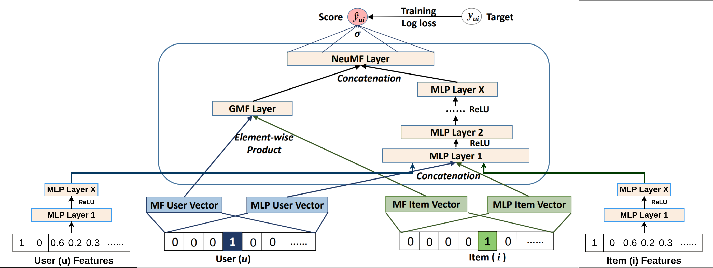

# NCF Recommender System with PyTorch

<p align="center">
  <strong>End-to-end neural recommendation system using an adjusted Neural Collaborative Filtering architecture, MovieLens-1M, FastAPI, and Streamlit.</strong>
</p>

<p align="center">
  <a href="#"></a>
  <a href="#"></a>
  <a href="#"></a>
  <a href="#"></a>
  <a href="#"></a>
</p>

<p align="center">
  <a href="https://github.com/Talha-Techie">GitHub Profile</a> ·
  <a href="#quick-start">Quick Start</a> ·
  <a href="#architecture">Architecture</a> ·
  <a href="#security">Security</a>
</p>

---

## Overview

**NCF Recommender System with PyTorch** is an end-to-end recommendation project based on an adjusted Neural Collaborative Filtering (NCF) architecture trained on the MovieLens-1M dataset. The model extends basic user/item ID collaborative filtering by allowing user and item features to participate in recommendation scoring.

The system separates model inference from user interaction through a FastAPI service and Streamlit interface, illustrating the broader recommendation pipeline beyond ranking alone.

### Business / Engineering Value

- Adjusted Neural Collaborative Filtering architecture.
- PyTorch model implementation and pretrained inference weights.
- MovieLens-1M training data.
- Support for user/item features in addition to IDs.
- FastAPI model serving and Streamlit user interface.
- Recommendation-system framing across retrieval, filtering, ranking, and ordering.

## Technology Stack

| Layer | Technology |
|---|---|
| Deep learning | PyTorch |
| Model | Neural Collaborative Filtering |
| Dataset | MovieLens-1M |
| Serving | FastAPI |
| Frontend | Streamlit |

---

## 🌟 Try it out!

- Website: [https://ncf-recsys.streamlit.app/](https://ncf-recsys.streamlit.app/)

## 📓 Notebook on Kaggle

- Notebook: [NCF Recommender System with PyTorch: A Deep Dive](https://www.kaggle.com/code/oyounis/ncf-recommender-system)

## Architecture & Model Overview



- Our adjusted architecture of NCF enables the input of the user/item features besides the user/item IDs.

- Quick Reminder: A recommender system is not just a ranking model, but a pipeline consisting of: Items Retrieval, Filtering, Ranking, and Ordering. (Detailed explanation in the notebook)

## 📚 Project Structure

- `streamlit.py`: Streamlit app to interact with the model.
- `app/`:

  - **main.py**: The FastAPI app to serve the model.
  - `model/`:
    - `utils/`:
      - `model.py`: The NCF model.
      - `utils.py`: Utility functions for data processing.
      - `requests.py`: Request class to make API requests.
    - `data/`: Processed data for inference.
    - `weights/`: Pretrained models weights for inference.

## 📖 References

- [Neural collaborative filtering Paper](https://arxiv.org/abs/1708.05031)
- [Medium: Recommender Systems, Not Just a Recommender Models](https://medium.com/nvidia-merlin/recommender-systems-not-just-recommender-models-485c161c755e)
- [MovieLens-1M](https://grouplens.org/datasets/movielens/1m/)

## 💡 Contributing

Contributions are welcome! If you find a typo, want to add more content, or improve something, feel free to open an issue or submit a pull request.

Happy learning! 🚀

---

## Security

For production use, treat uploaded documents, prompts, model outputs, credentials, user data, and tool/API responses as potentially sensitive.

Recommended controls include:

- Keep secrets in environment variables or a dedicated secret manager.
- Never commit `.env` files, API keys, database passwords, or tokens.
- Validate and constrain all external inputs before processing.
- Apply authentication and authorization to production endpoints where appropriate.
- Use least-privilege access for databases, tools, cloud resources, and service accounts.
- Enforce HTTPS/TLS at the deployment boundary.
- Add request limits, timeouts, structured logging, and dependency scanning.
- Review model/tool outputs before allowing irreversible actions.

> Security, compliance, SSO, RBAC, or enterprise governance capabilities should only be advertised when they are implemented and verified in the deployed environment.

## Production Considerations

Before operating this project in a production environment, consider adding or validating:

- Centralized logs and metrics
- Health and readiness checks
- Request tracing and correlation IDs
- Rate limiting and abuse controls
- Persistent state and backup strategy
- CI/CD quality gates
- Dependency and container vulnerability scanning
- Model/LLM latency, reliability, and cost monitoring where applicable
- Horizontal scaling and externalized state where required

## Contributing

Contributions are welcome.

```bash
git checkout -b feature/your-feature
git add .
git commit -m "feat: describe your change"
git push origin feature/your-feature
```

When opening a pull request, include the motivation, implementation summary, testing performed, and any API or architecture implications.

## Maintainer

Maintained by **Talha-Techie**.

- GitHub: [github.com/Talha-Techie](https://github.com/Talha-Techie)

## License

Refer to the repository's `LICENSE` file or the license section above for the applicable terms.

---

<p align="center">
  <strong>Designed as a clean, modular, production-oriented AI/ML engineering project.</strong>
</p>
